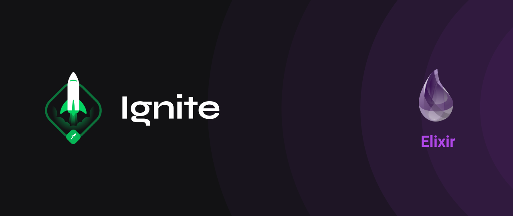

<h1 align="center">Rocketseat Ignite: Elixir</h1>

  <a href="#-about">About</a>&nbsp;&nbsp;&nbsp;|&nbsp;&nbsp;&nbsp;
  <a href="#-technologies">Technologies</a>&nbsp;&nbsp;&nbsp;|&nbsp;&nbsp;&nbsp;
  <a href="#-find-me">Find Me</a>&nbsp;&nbsp;&nbsp;|&nbsp;&nbsp;&nbsp;
  <a href="#-license">License</a>

  

## 💻 About

This repo holds all challenges and projects developed by me during the [Rocketseat Ignite: Elixir](https://pages.rocketseat.com.br/ignite) course.

## ✨ Technologies

This repo projects and challenges uses the following technologies:

- [Elixir](https://github.com/elixir-lang/elixir)
- [Phoenix](https://github.com/phoenixframework/phoenix)
- [PostgreSQL](https://www.postgresql.org)
- [Docker](https://www.docker.com)

## ⚡️ Find Me

- [Linkedin](https://www.linkedin.com/in/arilsonsouza)

## 📄 License

This project is under the MIT license. See the [LICENSE](LICENSE.md) file for more info.